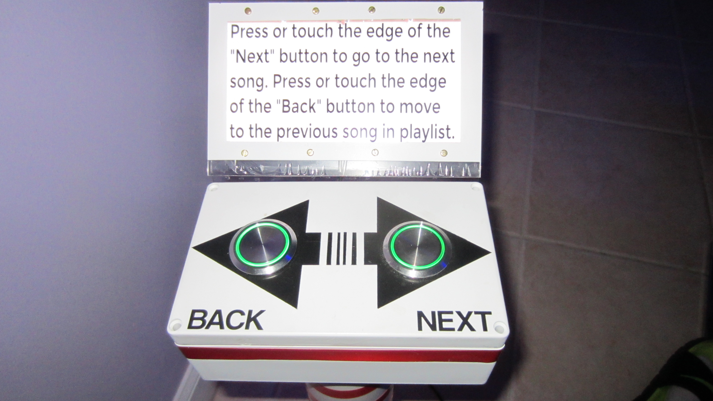
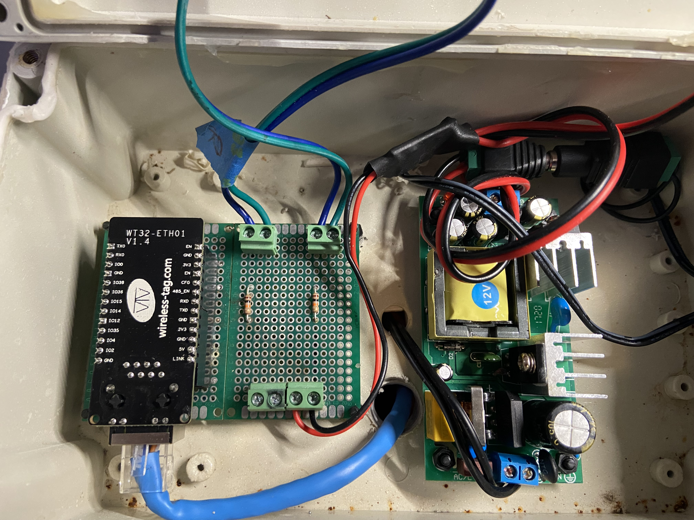

# ESP8266_xScheduleButtonsDemo

This is the modified sketch for the FPP/xScheduler interactive button it uses a ESP32 with a WT32_ETH01 serial to Ethernet Module. This ia a modification of a previous interactive button build reflashed to use MQTT.

Click the following link to view the video.

<a href="https://youtu.be/8NWRenqEm_Y">Button Demo Video!</a>

